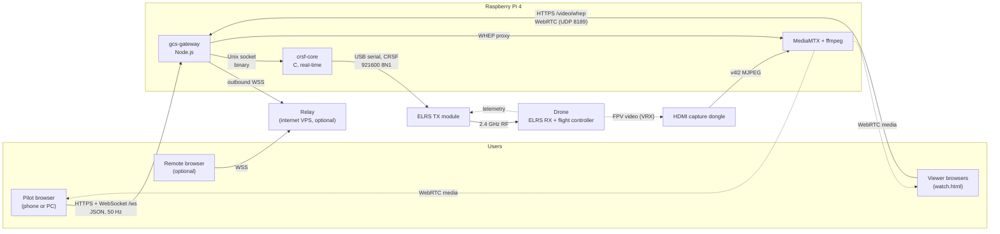
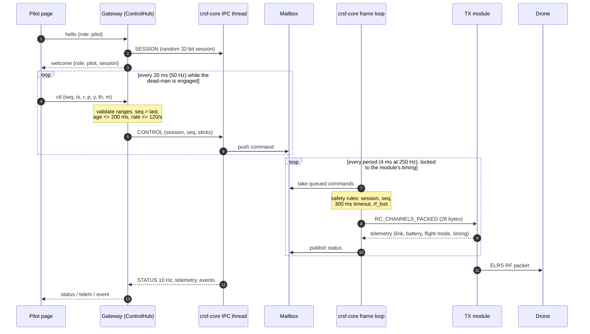
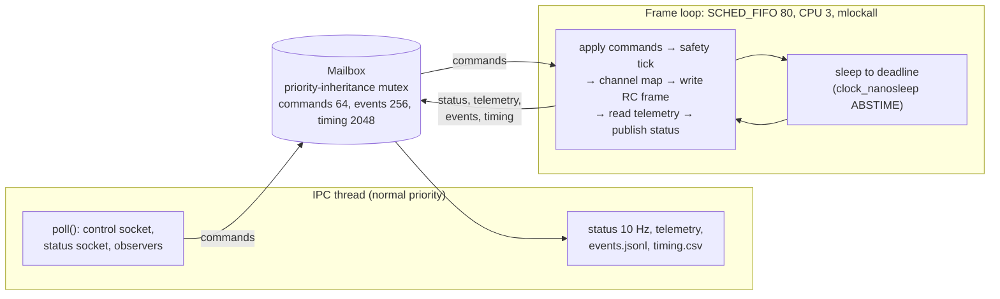
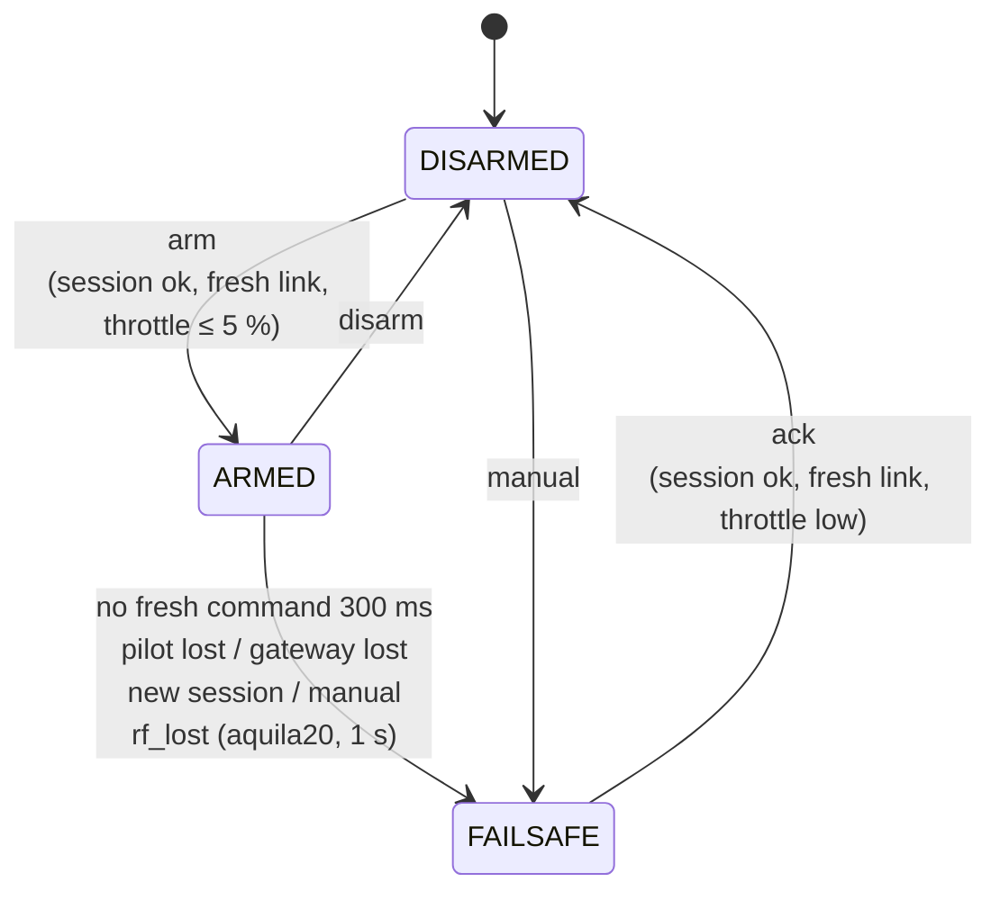
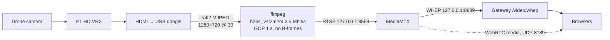

# Architecture

**Project:** Web Ground Control Station for an ExpressLRS drone (Proyecto Terminal, Universidad
Iberoamericana, Otoño 2026)
**Describes:** the code on `main` as of commit `fd85095` (2026-10-07), plus the input modes
(touch, keyboard, step) added on branch `feat/control-modes`
**Audience:** team members, reviewers, the mentor, and anyone continuing the work

This document explains how the system is built and why. It describes what exists today. The
design rationale and the decisions still awaiting confirmation are in the design spec
([`superpowers/specs/2026-10-05-elrs-web-gcs-design.md`](superpowers/specs/2026-10-05-elrs-web-gcs-design.md)),
and the development workflow is in [`DEVELOPMENT-PROCESS.md`](DEVELOPMENT-PROCESS.md).

---

## Contents

1. [Purpose and scope](#1-purpose-and-scope)
2. [System context](#2-system-context)
3. [Components](#3-components)
4. [The control path, end to end](#4-the-control-path-end-to-end)
5. [Pilot web application](#5-pilot-web-application)
6. [Gateway](#6-gateway)
7. [crsf-core (real-time bridge)](#7-crsf-core-real-time-bridge)
8. [Interfaces](#8-interfaces)
9. [Video path](#9-video-path)
10. [Internet relay](#10-internet-relay)
11. [Failure handling](#11-failure-handling)
12. [Deployment](#12-deployment)
13. [Observability and measurement](#13-observability-and-measurement)
14. [Security model](#14-security-model)
15. [Known limitations](#15-known-limitations)
16. [Glossary](#16-glossary)

---

## 1. Purpose and scope

A pilot flies an ExpressLRS (ELRS) drone from a web page on a phone or a computer, instead of
a handheld RC transmitter. A Raspberry Pi 4 sits between the web and the radio: it turns the
page's commands into CRSF frames for an ELRS TX module, and serves the drone's FPV video to
several local viewers.

| Requirement | Target | Where it is addressed |
|-------------|--------|-----------------------|
| Control from a browser on PC and Android | functional | gateway + pilot page (§5, §6) |
| Failsafe on every link | detection and response in < 1 s | safety state machine + timers (§7.4, §11) |
| Control must never be starved by video | design rule | real-time core on an isolated CPU; video limited to other CPUs (§12.2) |
| FPV video for 2 or more viewers | ≥ 2 viewers | MediaMTX + WebRTC (§9) |
| Optional control over the internet | prototype | relay (§10) |

**Out of scope:** video over the internet, autonomous flight, flight beyond visual line of
sight (BVLOS). All flights are VLOS (NOM-107-SCT3).

**Hardware**

| Item | Model | Notes |
|------|-------|-------|
| Bridge computer | Raspberry Pi 4, Debian 13 arm64, PREEMPT kernel | CPU 3 isolated for the real-time loop |
| TX module | BetaFPV ELRS Micro TX 1W, 2.4 GHz, ELRS 3.3.0 | connected by USB-C (CP2102 USB-UART); powered by XT30 (2S; **never 3S**) |
| Aircraft | BetaFPV Aquila20 HD, BetaFPV firmware, ELRS RX 3.5.6 | `fc_profile = aquila20` |
| Video | P1 HD VRX → HDMI → USB capture dongle | capture dongle not yet integrated (§15) |

---

## 2. System context



---

## 3. Components

| Component | Directory | Language | Runs as | Responsibility |
|-----------|-----------|----------|---------|----------------|
| **crsf-core** | `core/src/` | C (gnu11) | systemd `crsf-core`, user `gcs` | Owns the serial port, frame timing, channel mapping, **every arming and failsafe rule**, telemetry decoding, evidence logs |
| **crsf tools** | `core/tools/` | C | operator, on demand | `crsf-probe` (does the module answer?), `crsf-param` (ELRS settings), `crsf-ctl` (status, watch, keyboard pilot for bench tests) |
| **gcs-gateway** | `gateway/src/` | Node.js 22, one dependency (`ws`) | systemd `gcs-gateway`, user `gcs` | HTTPS, static files, WebSocket `/ws`, choosing the pilot, validation, stale-command filter, rate limit, WHEP proxy, relay client |
| **Pilot page** | `web/` | HTML/CSS/JS, no build step | browser | Virtual sticks, buttons, dead-man, link indicators, telemetry, video |
| **Watch page** | `web/watch.html` | HTML/JS | browser | Full-screen video and a 5-minute video-statistics recorder (criterion C4) |
| **Video** | `deploy/video/` | MediaMTX v1.21.1 + ffmpeg | systemd `gcs-video`, user `gcs-video` | Capture, hardware H.264 encoding, WebRTC fan-out |
| **Relay** | `relay/src/` | Node.js | VPS (not deployed yet) | Authenticated multiplexer between remote browsers and the Pi |
| **Analysis tools** | `tools/` | Python 3, Node.js | operator | Reports for criteria C1–C4, fault injection, relay round-trip times |

**Guiding principle:** *crsf-core decides what the aircraft does.* The gateway forwards,
filters and reports; the page shows state and sends stick values. A bug or crash above the core
can only cause the core to stop receiving fresh commands, which it treats as a failsafe.

---

## 4. The control path, end to end

### 4.1 Sequence



### 4.2 Where the time goes

The table below lists every stage a stick movement passes through. **These figures are
estimates from reading the code, not measurements.** End-to-end control latency is not
instrumented today (see §13.3 and §15).

| # | Stage | Mechanism | Estimated delay |
|---|-------|-----------|-----------------|
| 1 | Stick sampled | `setInterval` at 50 Hz reads the stick model | 0–20 ms (sampling) |
| 2 | Browser → gateway | WebSocket over Wi-Fi/LAN, TLS | 2–5 ms typical; much more on a poor link |
| 3 | Gateway processing | JSON parse, validation, binary encode | < 1 ms |
| 4 | Gateway → core | Unix socket, `poll()` wakes the IPC thread at once | < 1 ms |
| 5 | Wait for next frame | frame loop period | 0–4 ms |
| 6 | Serial write | 26 bytes at 921600 baud + CP2102 USB | ~1 ms |
| 7 | Radio and flight controller | ELRS packet slot, RF, RX, FC loop | a few ms |

---

## 5. Pilot web application

Files: `web/index.html`, `web/css/app.css`, `web/js/*.js`. Plain ES modules, no build step.
Every rule is in a *pure* module (no DOM) with unit tests in `web/test/`; `app.js` only
connects them to the page.

### 5.1 Screen layout

| Area | Content |
|------|---------|
| Header | Four link indicators: **Navegador** (browser ↔ Pi), **Núcleo** (gateway ↔ core), **TX** (core ↔ module), **Dron** (module ↔ drone, from LQ); the input-mode picker (**Táctil · Teclado · Prueba**); the safety state |
| Centre | Video (WebRTC), telemetry (battery, link, flight mode, `Latencia`, `Comando`), the on-air line (the stick values being sent, in %), dead-man message, notifications |
| Sides | Two stick pads (landscape: either side of the video; portrait: below it). In the keyboard and step modes they only display the values, and they are hidden on upright or short screens |
| Mode panel | Keyboard: key guide, intensity, throttle limit. Step: per-axis controls, step size, throttle limit, NEUTRO. On large screens (at least 1100 × 640 px) in these two modes the panel is a column on the right |
| Footer | `Tomar control`, `Armar` (hold), `Desarmar`, `FAILSAFE`, flight mode N / S / M |
| Banner | Shown in FAILSAFE: the reason and `Limpiar failsafe` (hold) |

The UI text is in Spanish; code and documentation are in English.

Look (`web/css/app.css`): dark surfaces; blue = control, green = correct / armed, amber = limit /
warning, red = danger, and red or amber always come with text. Barlow for labels and buttons,
JetBrains Mono for numbers; both are served from `web/fonts/` (SIL OFL 1.1) because the field
has no internet.

### 5.2 Input modes (`inputmode.js`, `sticks.js`, `keyboard.js`, `stepper.js`)

The pilot chooses how to fly with the picker in the header. Every mode produces the same
command (`roll, pitch, yaw` in −1000..1000, `throttle` 0..1000, flight `mode` 0..2), so **the
gateway and crsf-core do not know or care which mode is in use**, and the dead-man, arming and
failsafe rules apply unchanged.

| Mode | For | How it flies |
|------|-----|--------------|
| **Táctil** (`touch`) | phones, tablets | two virtual sticks, Mode 2 (below) |
| **Teclado** (`keyboard`) | computers | W/S throttle (holds where left), A/D yaw, ↑/↓ pitch, ←/→ roll (spring back); Shift = fine |
| **Prueba** (`step`) | bench tests | ± buttons per axis (1 / 5 / 10 % steps) or a typed value; every axis holds its value |

Rules common to all modes:
- **Default:** touch on a device whose main pointer is coarse (a touch screen), keyboard otherwise.
  The last choice is remembered per device (`localStorage`, optional: the page works without it).
- **The mode cannot change while ARMED.** Changing it resets every input to neutral with throttle
  at zero and disengages the dead-man, so the pilot must press `Tomar control` again.
- **Ramps (`ramp.js`):** in the keyboard and step modes values move away from neutral at a
  limited rate and towards neutral at once. A command can always be cut instantly and never jumps
  up. Time steps longer than 100 ms count as 100 ms, so a stalled page never jumps either.
- **Throttle limit** (keyboard and step modes, 30 / 50 / 100 %, default 30 %): it can be lowered
  at any time, which brings the throttle down to it at once, and raised only while not ARMED
  (`capChangeAllowed`). Each mode keeps its own limit. It is a convenience for bench tests, not a
  safety rule: crsf-core does not know about it.
- The on-air line always shows what is being sent.

**Keyboard mode** (`keyboard.js`). Keys are read by physical position (`KeyboardEvent.code`),
so the keyboard layout does not matter.

| Key | Action | Detail |
|-----|--------|--------|
| W / S | throttle up / down | 50 %/s while held (25 % with Shift); stays where left; never above the throttle limit (30 / 50 / 100 %, default 30 %) |
| A / D | yaw | to the intensity (30 / 50 / 100 %, default 50 %) in 150 ms; back to 0 on release |
| ↑ / ↓ | pitch forward / back | as yaw |
| ← / → | roll | as yaw |
| Shift | fine control | half deflection, half throttle rate |
| R (hold 1 s) | arm | same hold rule as the button; the core still checks throttle ≤ 5 % |
| Space | disarm | immediate. On the Aquila20, disarming in flight stops the motors |
| F | FAILSAFE | |
| 1 / 2 / 3 | flight mode N / S / M | |
| Esc | release control | the dead-man disengages. Leaving full screen does the same outside the touch mode, because browsers keep the Esc key that leaves full screen |

The action keys (R, Space, F, 1–3, Esc) also work in the other modes; no key does anything while
a value is being typed in an input. Key repeat is ignored, and every key counts as released when
the window loses focus or the page is hidden.

**Step mode** (`stepper.js`):
- Values change at 20 %/s towards the target; NEUTRO sets every axis to 0 and throttle to 0 at once.
- **Throttle limit** 30 % by default (30 / 50 / 100 %). It can be lowered at any time and raised
  only while not ARMED. Lowering it below the current throttle pulls the throttle down at once.
- A typed value above the limit is clamped and the pilot is told.

**Touch mode** (`sticks.js`):

- **Mode 2** layout. Left stick: throttle (vertical, *stays where released*) and yaw (horizontal,
  springs back). Right stick: pitch and roll (both spring back).
- Pointer Events with pointer capture. **One pointer per stick**: the first finger on a pad
  owns it, other fingers are ignored. Two thumbs can fly both sticks at once on a touch screen.
- Re-gripping the throttle does not make it jump: a held axis moves relative to where the
  finger landed.
- Output: `roll, pitch, yaw` in −1000..1000 and `throttle` in 0..1000; `mode` 0..2
  (N / S / M → CH6 1000 / 1500 / 2000 µs).

### 5.3 Dead-man (`deadman.js`)

Commands are sent only after the pilot presses **Tomar control**, and only while the page is
visible, focused and connected. Any lapse **disengages** the dead-man until the pilot presses it
again. In the touch mode, a further check disengages it if the stick pads move on screen (browser
bars, rotation, leaving full screen), because the value under the finger would jump. The pilot can
also release control on purpose (Esc), and changing the input mode releases it.

A disengaged page **sends nothing**. It does not send a "stop" message. If the drone is armed,
the core enters FAILSAFE 300 ms later. This means every way a page can fail (closed tab, crashed
browser, phone locked, Wi-Fi lost) ends the same way.

`Tomar control` also requests full screen, locks the current orientation and requests a screen
wake lock, where the browser supports them.

### 5.4 Dangerous actions (`hold.js`)

| Action | Gesture | Final check (in the core) |
|--------|---------|---------------------------|
| Arm | hold 1 s | current session, fresh commands, throttle ≤ 5 % |
| Clear failsafe | hold 2 s | as above; always ends DISARMED |
| Disarm | tap | always accepted |
| Manual FAILSAFE | tap | always accepted |

Refusals come back from the core as `event` messages and are shown in Spanish
(`REFUSAL_TEXT` in `protocol.js`).

### 5.5 Connection behaviour (`app.js`, `protocol.js`)

- On every new WebSocket connection the sequence counter restarts at 0 and the gateway assigns
  a new session. Nothing is queued while disconnected, so no old command can be replayed.
- Reconnects every 1 s after a close. If a page wanted the pilot seat but got the observer seat
  (its old connection still held it), it reconnects as soon as the seat is free.
- `?observe` opens a read-only view. `?room=<name>` connects through the relay and asks for the
  room's pilot token (kept in `sessionStorage`).

---

## 6. Gateway

Files: `gateway/src/`. Entry point `main.js` loads `/etc/gcs/gateway.json` (`config.js`).

| Module | Role |
|--------|------|
| `server.js` | HTTPS server, upgrade to `/ws` (with Origin check), WebSocket heartbeat (1 s ping; dead sockets terminated), 2 s clock-sync tick |
| `hub.js` | `ControlHub`: pilot selection, validation, stale filter, rate limit, broadcasting |
| `clock.js` | `ClockSync`: estimates each browser's clock offset |
| `ipc.js` | `CoreClient`: binary protocol to crsf-core, reconnects, decodes status and telemetry |
| `static.js` | Static files, GET/HEAD only, no path escape |
| `whep.js` | Proxies WHEP signalling (`/video/whep`) to MediaMTX on localhost |
| `relayClient.js` | Outbound connection to the relay; each remote browser becomes a normal hub client |

### 6.1 ControlHub rules (`hub.js`)

- **Exactly one pilot.** The first client to send `hello {role: pilot}` while the seat is free
  becomes the pilot; everyone else is an observer. There is no take-over while a pilot is connected.
- **One session per pilot connection.** A random 32-bit session is sent to the core with
  `SESSION`. When the pilot's socket closes, the hub sends `PILOT_LOST`.
- **Validation.** `ctl` must have integer `seq` greater than the last, numeric `ts`, and every
  axis in range. Invalid messages are dropped silently and never refresh the core's timer.
- **Stale filter.** With a clock estimate available, a `ctl` older than `maxCommandAgeMs`
  (200 ms) is dropped and counted in `staleDropped`.
- **Rate limit.** 120 messages per second per client (the page sends 50).
- **Observers** may send only `hello`, `ping` and `tsync_r`; commands are refused.
- **Telemetry cache.** The latest telemetry of each kind is replayed to new clients.
- **Core restart.** When the core reconnects, the pilot gets a new session; any latched
  failsafe remains and must be cleared and re-armed explicitly.

### 6.2 Clock synchronisation (`clock.js`)

Every 2 s the gateway sends `tsync {s0}` to the pilot; the page replies with its own
`performance.now()` as `c1`; the gateway receives it at `s2`.

```
rtt    = s2 − s0
offset = c1 − (s0 + s2) / 2          (error ≤ rtt / 2)
```

The sample with the smallest RTT among the last 8 is used. A command's age is then
`now − (ts − offset)`. This value feeds the stale filter, and `rtt` is displayed as `Latencia`.

---

## 7. crsf-core (real-time bridge)

Files: `core/src/`. Configuration: `/etc/gcs/crsf-core.conf` (every key documented in
`core/src/config.h`).

### 7.1 Threads



- **Frame loop** (`rtloop.c`): the only thread that touches the serial port. It never performs
  file or socket I/O. Reads are bounded (4 × 256 bytes per tick) so it never spins.
- **IPC thread** (`ipcserver.c`): the Unix-socket server and all file I/O.
- **Mailbox** (`mailbox.c`): the only shared state. The lock is held only for short copies.

If real-time setup fails (no `CAP_SYS_NICE`, CPU not available) and `rt_required = true`,
the daemon refuses to start and logs why.

### 7.2 Frame timing (`txsched.c`)

The ELRS module sends a *timing* frame about every 200 ms, with the interval it wants and an
offset (0.1 µs units; positive = send later). The scheduler adopts the interval (clamped to
0.5–50 ms) and applies `offset − sync_margin_us` once to the next deadline (clamped to ±½
period). With `sync_margin_us = 1000`, frames arrive about 1 ms before each radio packet, as
headroom for USB timing noise. Missed slots are skipped on the same grid, never sent in a
burst. Bench result: the offset settles at +982…+1033 µs and the worst wake-up delay is 25–41 µs.

### 7.3 Serial handling

- Opens the port exclusively, non-blocking, at the configured baud (921600).
- After opening, and whenever the module is silent for 1 s or has not identified itself yet,
  sends a *model select* and a *device ping*.
- Write errors such as `EIO`/`ENODEV` (module unplugged) close the port; it is retried every
  500 ms.

### 7.4 Safety state machine (`safety.c`)

Pure logic: the caller passes the time in, which makes every rule unit-testable.



- **Fresh command:** belongs to the current session *and* has a sequence number greater than the
  last one applied. Repeats, reordered and late messages never refresh the timer.
- **FAILSAFE is latched.** Only an explicit acknowledgement clears it, and clearing always ends
  in DISARMED: flying again needs a new arm.
- **Disarm is always accepted.** In FAILSAFE it lowers ARM but stays latched.
- **Outputs in FAILSAFE:** sticks centred, throttle 0, and per profile:
  - `aquila20` (default): **ARM low**, so the drone disarms (its motors stop; it does not land);
  - `betaflight`: FAILSAFE switch (CH7) high, ARM unchanged, Betaflight runs its own procedure.
- **`rf_lost` (aquila20 only):** armed with no link report with uplink LQ > 0 for 1 s →
  FAILSAFE, so the core's state matches a drone that has disarmed itself.
- The core starts DISARMED and is **not** restarted automatically by systemd. A restarted core
  would send ARM low, which is a disarm in flight; without a restart, the drone's own RX-loss
  failsafe acts.

### 7.5 Channel map (`chmap.c`)

| Channel | Function | Values (µs) |
|---------|----------|-------------|
| CH1–CH4 | roll, pitch, throttle, yaw (AETR) | 1000–2000 |
| CH5 | ARM | 1000 / 2000 |
| CH6 | flight mode N / S / M | 1000 / 1500 / 2000 |
| CH7 | `aquila20`: the drone's stick sensitivity, always 1000 (S). `betaflight`: FAILSAFE switch | 1000 / 2000 |
| CH8–CH16 | unused | 1000 |

### 7.6 Evidence logs (`evlog.c`)

- `events.jsonl` (always on): state changes with `cmd_age_ms`, refusals, flight-mode changes,
  serial up/down, module identity and firmware, ELRS timing samples, gateway connects.
  Monotonic time plus wall-clock time.
- `timing.csv` (only while measuring C1, ~80 MB/hour): deadline, wake-up, write start and end,
  period and shift for every frame.

---

## 8. Interfaces

### 8.1 Browser ↔ gateway (WebSocket `/ws`, JSON, ≤ 4 KiB per message)

| Browser → gateway | Meaning |
|-------------------|---------|
| `hello {role: "pilot" \| "observer"}` | must be the first message |
| `ctl {seq, ts, r, p, y, th, m}` | 50 Hz; `r,p,y` −1000..1000, `th` 0..1000, `m` 0..2, `ts` = `performance.now()` |
| `arm`, `disarm`, `ack`, `failsafe` | pilot only |
| `tsync_r {s0, c1}` | reply to `tsync` |
| `ping {id, ts}` | answered with `pong` |

| Gateway → browser | Meaning |
|-------------------|---------|
| `welcome {role, session?, reason?}` | role granted; `reason: "pilot_present"` if the seat was taken |
| `status {...}` | 10 Hz: core state, reason, `cmdAgeMs`, counters, channels, `core`, `pilot`, `rttMs`, `staleDropped` |
| `telem {link \| battery \| flightMode \| device}` | decoded telemetry |
| `event {what, refused}` | arm or ack refused, with the reason |
| `tsync {s0}` | every 2 s, pilot only |
| `pong`, `error` | |

### 8.2 Gateway ↔ crsf-core (Unix stream socket)

Message: `u16 length (LE) | u8 type | payload`, little-endian, at most 255 bytes. The C codec
(`core/src/ipc_proto.c`) and the JavaScript codec (`gateway/src/ipc.js`) are pinned to the same
golden bytes in both test suites.

| Type | Direction | Payload |
|------|-----------|---------|
| `0x01` SESSION | gw → core | u32 session |
| `0x02` CONTROL | gw → core | u32 session, u32 seq, i16 roll, i16 pitch, i16 yaw, u16 throttle, u8 mode |
| `0x03`–`0x07` ARM, DISARM, ACK, PILOT_LOST, FAILSAFE | gw → core | u32 session |
| `0x81` STATUS | core → gw | 80 bytes, 10 Hz (state, reason, session, last seq, command age, counters, period, ELRS offset, worst wake-up, 16 channels) |
| `0x82`–`0x85` LINK, BATTERY, FLIGHT_MODE, DEVICE | core → gw | decoded telemetry |
| `0x86` EVENT | core → gw | refusal kind and reason |

Two sockets: `core.sock` (one controller; a new connection replaces the old one, which counts as
*gateway lost*) and `status.sock` (up to 4 read-only observers such as `crsf-ctl watch`; what
they send is ignored). Read-only tools are therefore safe to use while flying.

### 8.3 crsf-core ↔ TX module (CRSF over USB serial)

921600 baud, 8N1, through the module's CP2102 USB-UART. This requires the module's DIP switches
1–2 ON (3–7 OFF) and its CRSF pins remapped to RX 3 / TX 1 (`docs/setup/module.md`).

| Sent | Received |
|------|----------|
| `RC_CHANNELS_PACKED` (0x16) every period | timing (0x3A / 0x10) |
| model select and device ping at start and on silence | link statistics (0x14) |
| parameter read/write (0x2C/0x2D), `crsf-param` only | battery (0x08), flight mode (0x21), device info (0x29), parameter entries (0x2B) |

Channel values 172–1811 (centre 992) map to 1000–2000 µs.

---

## 9. Video path



- MediaMTX starts `capture.sh` (`runOnInit`). `VIDEO_SOURCE=test` uses a generated test pattern
  instead of the dongle.
- Only the small WHEP/SDP exchange goes through the gateway, so the video shares the pilot page's
  origin and TLS certificate. The media flows directly from MediaMTX over UDP.
- MediaMTX listens on localhost only, except WebRTC media. Its API, metrics, HLS, RTMP, SRT and
  MoQ servers are off.
- **Isolation from control:** `gcs-video` runs as its own user, on CPUs 0–2 only, with
  `CPUWeight=50` and `Nice=10`. The encoder is the Pi's hardware encoder (~9 % CPU at 720p30).
- The browser player retries every 2 s on its own. The pilot page shows video only on the local
  network.

---

## 10. Internet relay

Status: implemented and tested locally; **not deployed** (§15).

- The Pi **dials out** to the relay (no inbound ports on the Pi). Remote browsers connect to the
  relay, which multiplexes them over the Pi's single connection.
- The relay never parses control messages and **buffers nothing**: a message for a peer that is
  not connected is dropped.
- Each remote browser becomes an ordinary `ControlHub` client on the Pi, so every local rule
  (one pilot, new session per connection, stale filter, pilot lost → failsafe) applies unchanged.
- First message: `hello {role, room, token}`. Tokens are hex strings of at least 32 characters,
  compared in constant time. Limits: 4 remote clients per room, 120 messages/s per client,
  4 KiB frames, 5 s hello timeout.
- Close codes: 4000 bad hello, 4001 Pi not connected, 4002 bridge replaced, 4003 denied,
  4004 room full.
- Video is not relayed (out of scope).

---

## 11. Failure handling

| Segment | Failure | Detected by | Response | Budget |
|---------|---------|-------------|----------|--------|
| Pilot ↔ Pi | Wi-Fi loss, tab hidden, browser crash | page: dead-man stops sending; gateway: socket close → `PILOT_LOST`; core: no fresh command for 300 ms | FAILSAFE in the next frame | ≤ 300 ms + 1 frame |
| Pilot ↔ relay ↔ Pi | internet loss, relay down | same core timer; relay close → pilot lost | same | same |
| Inside the Pi | gateway crash | core: control socket closed → `GATEWAY_LOST` | same; systemd restarts the gateway, the pilot must clear and re-arm | immediate |
| Inside the Pi | crsf-core crash | the module stops receiving frames | the drone's own RX-loss failsafe (Aquila20: motors stop at once) | immediate |
| Pi ↔ aircraft | RF loss, module unplugged | the drone; and the core (`rf_lost`, no LQ > 0 for 1 s) | drone disarms; core latches FAILSAFE | ≤ 1 s |

**Re-arm after any reconnect:** a reconnected page gets a new session and starts at sequence 0;
the core never applies commands from an old session; a latched failsafe must be cleared with a
hold, which ends DISARMED; then a new hold-to-arm is required.

---

## 12. Deployment

### 12.1 Processes and users

| systemd unit | Binary | User | Restart policy | Notes |
|--------------|--------|------|----------------|-------|
| `crsf-core` | `/usr/local/bin/crsf-core` | `gcs` (+ `dialout`) | **never** (by design, §7.4) | `CAP_SYS_NICE`, `CAP_IPC_LOCK`; `NoNewPrivileges` |
| `gcs-gateway` | `node /opt/gcs/gateway/src/main.js` | `gcs` | on failure, after 2 s | safe to restart (core fails safe meanwhile) |
| `gcs-video` | `/opt/mediamtx/mediamtx` | `gcs-video` (+ `video`) | on failure, after 2 s | CPUs 0–2, `CPUWeight=50`, `Nice=10` |

`deploy/install.sh` creates the users, builds and installs the core, copies the gateway and web
app to `/opt/gcs`, installs configuration files without overwriting existing ones, creates a
self-signed certificate, installs MediaMTX (pinned version, SHA-256 checked) and enables the
units.

### 12.2 CPU allocation

| CPU | Used by |
|-----|---------|
| 0–2 | Linux, gateway, IPC thread, video (`AllowedCPUs=0-2`), all IRQs (`irqaffinity=0-2`) |
| 3 | crsf-core frame loop only (`isolcpus=3`, `SCHED_FIFO 80`) |

### 12.3 Network ports

| Port | Bound to | Service |
|------|----------|---------|
| 8443/tcp | all interfaces | gateway HTTPS + WebSocket |
| 8189/udp | all interfaces | WebRTC media |
| 8889/tcp | 127.0.0.1 | MediaMTX WebRTC/WHEP (reached through the gateway) |
| 8554/tcp | 127.0.0.1 | MediaMTX RTSP (ffmpeg → MediaMTX) |

### 12.4 Configuration files

| File | Contents |
|------|----------|
| `/etc/gcs/crsf-core.conf` | serial device (stable `/dev/serial/by-id/...` name), baud, sockets, logs, `cmd_timeout_ms` (300), `sync_margin_us` (1000), real-time settings, `fc_profile`, channel layout |
| `/etc/gcs/gateway.json` | listen address and port, TLS files, core socket, web root, `maxCommandAgeMs` (200), video WHEP URL, relay settings |
| `/etc/gcs/mediamtx.yml`, `/etc/gcs/video.env` | MediaMTX and capture settings (device, size, frame rate, bitrate, source) |
| `/etc/gcs/tls/` | self-signed certificate (`deploy/make-cert.sh`) |

---

## 13. Observability and measurement

### 13.1 Live indicators on the pilot page

| Indicator | Source | Meaning |
|-----------|--------|---------|
| Navegador | page | WebSocket open and a message received in the last second |
| Núcleo | gateway status | core connected and status fresh (< 500 ms) |
| TX | core status | serial port open and timing frames still arriving (< 1 s) |
| Dron | link telemetry | uplink LQ > 0 in the last 2 s (≥ 70 % = green) |
| `Latencia` | gateway `rttMs` | **minimum** browser↔gateway round trip of the last 8 clock-sync samples (≈ 16 s). Best case, round trip, stops at the gateway |
| `Comando` | core `cmdAgeMs` | time since the last fresh command was applied, sampled at 10 Hz. A freshness indicator (normally 0–20 ms), not a latency |

### 13.2 Acceptance criteria and tools

| Criterion | What | Method | Tool | Default limit |
|-----------|------|--------|------|---------------|
| C1 | CRSF frame jitter | per-frame timing log, 10 min per condition | `tools/analysis/timing_report.py` | p99 ≤ 250 µs, max ≤ 1 ms, no missed slot (proposal P6) |
| C2 | Video latency, glass to glass | photo of `web/clock.html` seen directly and through the video | `tools/analysis/latency_report.py` | 90 % of readings ≤ 300 ms |
| C3 | Failsafe detection | timestamped fault injection vs. `events.jsonl` | `tools/analysis/fault.py`, `failsafe_report.py` | ≤ 1000 ms, every link, 10 runs each |
| C4 | Video concurrency | in-page recorder on `watch.html`, 5 min | `web/js/videostats.js` | ≥ 2 viewers, no stalls |
| Relay | Round trip and loss | observer pings through the relay | `tools/relay-rtt.mjs` | report only |

### 13.3 What is not measured

No component follows an individual command from the stick to the frame written to the module,
so **end-to-end control latency is not measured.** The building blocks exist (the command `ts`,
the clock offset, `seq` reaching the core, per-frame write timestamps), but nothing links them.
The radio segment (module → drone → motors) can only be measured externally.

---

## 14. Security model

| Control | Status |
|---------|--------|
| TLS between browsers and the Pi | yes, self-signed certificate (each browser accepts it once) |
| Only the gateway's own pages may open `/ws` | yes, `Origin` check (tools without `Origin` are allowed) |
| Input validation, message size and rate limits | yes, gateway and relay |
| Core socket access | file permissions, group `gcs` |
| MediaMTX exposure | localhost only, except WebRTC media; API off; own user |
| Relay authentication | yes, per-room tokens, constant-time comparison |
| **Authentication on the local pilot page** | **no.** Anyone who can reach port 8443 can take a free pilot seat and arm the drone |

The local page must therefore stay on a trusted network. It must never be exposed to the
internet (for example through a tunnel) until a login exists. See the open item in
`docs/HANDOFF.md` §6.

---

## 15. Known limitations

| Area | Limitation |
|------|------------|
| Security | No login on the local pilot page (§14) |
| Input | Touch, keyboard and step modes (§5.2). No gamepad input yet. Keyboards with few simultaneous keys ("ghosting") may drop a third or fourth key held at once |
| Latency | End-to-end control latency is not instrumented (§13.3). Sticks are sampled by a 50 Hz timer, which adds up to 20 ms |
| Measurement | C1–C4 campaigns not run yet; relay not deployed; real video capture not integrated (test pattern only) |
| Platform | crsf-core is Linux-only (Unix sockets, `SCHED_FIFO`, `termios`, `accept4`); `tools/analysis/fault.py` needs `/proc` |
| Thermal | The Pi reached 74–82 °C and throttled during browser and video tests without a heatsink |
| Decisions | Proposals P1–P11 (spec §2), including the 300 ms timeout and the C1 limits, await confirmation |
| Licence | The repository has no LICENSE file |

---

## 16. Glossary

| Term | Meaning |
|------|---------|
| **CRSF** | Crossfire serial protocol, used between ELRS modules, receivers and flight controllers |
| **ELRS** | ExpressLRS, the open-source RC link used by the TX module and the drone's receiver |
| **LQ** | Link quality: the percentage of radio packets received |
| **Session** | A random 32-bit number identifying one pilot connection; the core ignores commands from any other session |
| **Fresh command** | A control message from the current session with a higher sequence number than the last one |
| **Dead-man** | The page sends commands only while the pilot has deliberately taken control and the page is in front of them |
| **FAILSAFE (latched)** | The safe state entered on any link loss; it lasts until explicitly cleared |
| **WHEP** | WebRTC-HTTP Egress Protocol, used by browsers to start WebRTC playback |
| **VLOS / BVLOS** | Visual line of sight / beyond visual line of sight |
