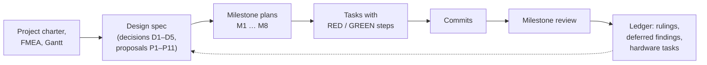

# Development process

**Describes:** how the project has been planned, built, tested and verified up to commit
`fd85095` (2026-10-07), and the workflow the team uses from now on.
**Companion documents:** [`ARCHITECTURE.md`](ARCHITECTURE.md) (how the system works) and
[`HANDOFF.md`](HANDOFF.md) (current status, bench findings, open items).

---

## Contents

1. [Documentation map](#1-documentation-map)
2. [How the work is planned](#2-how-the-work-is-planned)
3. [How a task is implemented](#3-how-a-task-is-implemented)
4. [Source control](#4-source-control)
5. [Development environments](#5-development-environments)
6. [Test suites](#6-test-suites)
7. [Hardware and bench work](#7-hardware-and-bench-work)
8. [Deployment to the Raspberry Pi](#8-deployment-to-the-raspberry-pi)
9. [Measurement campaigns](#9-measurement-campaigns)
10. [Status by milestone](#10-status-by-milestone)
11. [Definition of done](#11-definition-of-done)

---

## 1. Documentation map

| Document | Purpose | Updated when |
|----------|---------|--------------|
| `README.md` | Entry point: what the project is, layout, test commands, safety summary | layout or commands change |
| `docs/ARCHITECTURE.md` | How the system is built and why | the architecture changes |
| `docs/DEVELOPMENT-PROCESS.md` | This document | the workflow changes |
| `docs/HANDOFF.md` | Current status, hardware facts learned on the bench, open items | at the end of each work session |
| `docs/superpowers/specs/` | Design specifications (main design, Aquila20 profile) | a design decision changes (as a dated amendment) |
| `docs/superpowers/plans/` | One implementation plan per milestone (M1–M8), task by task | written before a milestone starts |
| `docs/superpowers/ledgers/` | What actually happened per plan: completed tasks, commits, test results, **rulings**, deferred findings | while a plan is executed |
| `docs/setup/` | Hardware and OS setup: module, Aquila20, Betaflight, Pi real-time | a setup step is learned or changed |
| `docs/procedures/` | Bench and measurement procedures with recorded results | a procedure is run |
| `CLAUDE.md` | Rules for AI coding agents working in this repository | the workflow changes |

---

## 2. How the work is planned



1. **Inputs.** The project charter, the boundary and P-diagrams, the Gantt chart and the
   FMEA/DFMEA (kept outside this repository).
2. **Design spec.** Records the team's decisions (D1–D5) and the proposals made while planning
   (P1–P11), which still need team or mentor confirmation. Later changes are added as dated
   amendments (for example, the 2026-10-07 switch from Betaflight to the Aquila20 firmware).
3. **Milestone plans.** Each milestone has a plan in `docs/superpowers/plans/` that produces
   working, tested software on its own. A plan lists its files and splits the work into tasks.
   Each task has exact steps: the failing test to write, the expected failure, the
   implementation and the commit message.
4. **Ownership** follows the Gantt chart: firmware and core (M1–M3, M5) and web, video and relay
   (M4, M6, M7).

| Milestone | Delivers |
|-----------|----------|
| M1 | CRSF library, `crsf-probe`, `crsf-param`, module verification |
| M2 | Configuration, channel map, safety state machine |
| M3 | Real-time daemon, `crsf-ctl`, systemd units, bench test |
| M4 | Gateway, pilot page, HTTPS, browser end-to-end test |
| M5 | C1 and C3 analysis tools and measurement campaigns |
| M6 | Video pipeline, WHEP proxy, watch page, C2 and C4 |
| M7 | Internet relay, relay mode, round-trip tool (optional) |
| M8 | Aquila20 flight-controller profile |

---

## 3. How a task is implemented

Every task follows **test-driven development**:

1. **RED.** Write the test first. Run it and confirm it fails *for the reason the plan expects*.
   A test that fails for another reason, or passes, means the test is wrong.
2. **GREEN.** Implement the smallest change that makes it pass.
3. **Run every suite** (§6), not only the new test.
4. **Commit** the task.

When a plan step cannot be applied as written (for example because an earlier review fix
changed the code), the same intent is applied by hand and a **Ruling** is recorded in the ledger.

After each milestone, a **fresh reviewer** (read-only) goes through the whole commit range.
Critical and Important findings are fixed test-first; Minor findings are recorded in the ledger
as `Final: minor (deferred)`.

**Ledgers** (`docs/superpowers/ledgers/`) record, per plan:
- every completed task with its commit range and test result;
- every **Ruling**: a decision taken on the team's behalf, with its cost if it turns out wrong;
- every deferred minor finding;
- every task deferred because it needs hardware.

> The plans show the code as it was *before* the milestone reviews. Git history and the ledgers
> are authoritative for what the code does now.

The helper scripts used to run plans step by step are in `docs/superpowers/exec-tools/`
(see its README). They depend on paths on the Pi.

---

## 4. Source control

**Repository:** `github.com/AustenLynn/elrs-web-gcs`, a single monorepo (proposal P11).

### 4.1 History so far

Milestones M1–M8 were developed directly on `main` (82 commits, 2026-10-06 to 2026-10-07),
pushed when the user asked.

### 4.2 Workflow from now on

| Rule | Detail |
|------|--------|
| No direct commits to `main` | Every change goes on a branch and is merged through a pull request reviewed by a teammate |
| Branch names | `feat/…`, `fix/…`, `docs/…`, `test/…` |
| Small, focused commits | One logical change per commit; no unrelated refactoring |
| Commit messages | The repository's existing style: `<component>: <what changes, in plain words>`, with components `core`, `gateway`, `web`, `relay`, `tools`, `deploy`, `docs` (for example `web: going full screen no longer drops control`) |
| Never committed | Build outputs (`core/build/`), `node_modules/`, Python caches, secrets (tokens, keys, passwords), large binaries |
| Pull request | Summary, why, how it was tested, a **hardware-safety checkbox**, the linked issue |

> `CLAUDE.md` and `HANDOFF.md` §4 still describe the earlier "commit on `main`" practice and
> need updating to this workflow.

---

## 5. Development environments

| Environment | What works | What does not |
|-------------|------------|---------------|
| **Raspberry Pi 4** (Debian 13 arm64, PREEMPT kernel, gcc 14, Node 22, Python 3.13, Firefox) | everything: all test suites, the real module, real-time timing, video hardware encoding, bench tests | — |
| **Linux VM or WSL2** (Debian/Ubuntu, gcc, Node ≥ 22, Python 3, Firefox) | all software test suites, including C unit and integration tests against the fake TX module and the browser end-to-end test | real-time timing, the hardware video encoder, the real module (USB passthrough is not a supported way to fly or bench-test) |
| **macOS or Windows** without a VM | gateway, web and relay tests (Node 22); Python analysis tests except `test_fault` (needs `/proc`) | the C core does not compile (Linux-only APIs) |

On an Apple Silicon Mac, an arm64 Debian 13 VM (for example OrbStack, UTM or Lima) matches the
Pi's architecture and operating system.

To run `crsf-core` by hand outside the Pi, use a local copy of the configuration with
`rt_required = false`.

---

## 6. Test suites

Run from the repository root. Install the Node packages once:
`npm --prefix relay install && npm --prefix gateway install` (the gateway's tests import the relay).

| Suite | Command | Count | Covers |
|-------|---------|-------|--------|
| C unit (UBSan) | `make -C core test` | 100 | CRC, frames, frame splitting, telemetry, parameters, serial on a pseudo-terminal, configuration, channel map, safety (21 scenarios), scheduler, IPC codec, mailbox, logs |
| C integration | `make -C core integration` | 29 | real binaries against an independent Python fake TX module on a pseudo-terminal: timing follow, arming, timeouts, refusals, telemetry, parameters |
| Gateway + web | `npm --prefix gateway test` | 126 | hub, clock sync, IPC codec (shared golden bytes with C), static files, configuration, WHEP proxy, relay path; page modules: sticks, keyboard, step mode, ramps, input-mode rules, dead-man, hold, view, video statistics |
| Relay | `npm --prefix relay test` | 11 | token checks, limits, multiplexing, close codes |
| Analysis tools | `python3 -W error -m unittest discover -s tools/analysis -t tools/analysis` | 26 | C1–C4 reports, fault injector |
| Browser end-to-end | `make -C core && npm --prefix gateway run e2e` | 6 | headless Firefox → pilot page → gateway → crsf-core → fake module: hold-to-arm raises CH5; losing focus fails safe in < 1 s; keyboard mode (hold R arms, W raises and holds throttle, Space disarms); phone layouts (touch mode); video through MediaMTX and the WHEP proxy |

Notes:
- **Golden bytes:** RC frames are checked against the reference project's output, other CRSF
  frames against an independent Python implementation, and the core↔gateway messages against
  bytes shared by the C and JavaScript tests.
- The video end-to-end test uses `/opt/mediamtx/mediamtx` (or `MEDIAMTX=<path>`) and is skipped
  if MediaMTX is missing.
- On the Pi, let it cool before browser or video tests (`vcgencmd measure_temp`): when it
  throttles, the video test drops frames.

---

## 7. Hardware and bench work

### 7.1 Safety rules (always)

- **Propellers off** for every bench step.
- Never power the TX module without its antenna.
- Power the module from its XT30 at 5–12 V (2S recommended). **Never 3S (12.6 V)**: it destroys
  the module's power chip. USB alone cannot power the 1 W module.
- **Disarm before anyone touches the drone or its battery.**
- Flights only at the agreed test site, in visual line of sight, under the mentor's rules.
- Anything that sends commands to hardware is gated by an explicit arming step and starts in a
  safe state (the core starts DISARMED).

### 7.2 Bench procedure

The M3 bench test (`docs/procedures/m3-bench-test.md`) is the reference procedure: 15 steps,
each with an expected result and the recorded result. It uses `crsf-ctl watch` (read-only) and
`crsf-ctl pilot` (keyboard pilot), with the gateway stopped, because both use the core's control
socket. It was run on 2026-10-07 with the real module and the Aquila20: **15/15 PASS**.

### 7.3 Order of the remaining hardware tasks

M4 Task 10 (PC and Android checklist) → M5 Tasks 3–4 (C1 and C3 campaigns) → M6 Task 6 (real
video, C2, C4, C1 under video load) → M7 Task 6 (relay deployment and internet tests).

---

## 8. Deployment to the Raspberry Pi

One-time real-time setup (`docs/setup/pi-realtime.md`): append `isolcpus=3 irqaffinity=0-2` to
the single line in `/boot/firmware/cmdline.txt` and reboot.

Install or update (safe to re-run; existing configuration files are kept):

```bash
sudo deploy/install.sh
sudo systemctl restart crsf-core gcs-gateway gcs-video
```

Check:

```bash
systemctl status crsf-core gcs-gateway gcs-video --no-pager
crsf-ctl status
ps -eLo pid,tid,cls,rtprio,psr,comm | awk 'NR==1 || /crsf-core/'
```

Exactly one crsf-core thread must show `FF 80` on CPU 3. Then open `https://<pi-address>:8443`
and accept the self-signed certificate once per browser.

Module preparation (`docs/setup/module.md`): DIP switches 1–2 ON and 3–7 OFF; CRSF pins remapped
on the module's Wi-Fi page; firmware recorded with `crsf-probe`; ELRS settings with `crsf-param`.

---

## 9. Measurement campaigns

| Criterion | Procedure | Status |
|-----------|-----------|--------|
| C1 frame jitter | timing log, 10 min per condition (runs A–D, including under video load) | not run |
| C2 video latency | photos of `web/clock.html` direct vs. through the video | not run (needs the capture dongle) |
| C3 failsafe | `fault.py` injects timestamped faults; `failsafe_report.py --since <start> --no-fc` | not run as a campaign; single bench result: `cmd_timeout` at 304 ms |
| C4 video concurrency | `watch.html` recorder on each viewer, 5 min | not run |
| Relay round trip | `tools/relay-rtt.mjs` | not run (relay not deployed) |
| End-to-end control latency | — | no method yet |

Before any timing-sensitive measurement: heatsink or fan fitted, Pi temperature checked, and the
time and conditions written down. Results are recorded in the procedure documents, like the M3
bench test. WAN latency must not be claimed until it is measured.

---

## 10. Status by milestone

| Milestone | Software | Hardware tasks |
|-----------|----------|----------------|
| M1 CRSF library and tools | done | done (module verified: ELRS 3.3.0 at 921600 baud; RX 3.5.6) |
| M2 Safety logic | done | — |
| M3 crsf-core | done | done (bench test 15/15) |
| M4 Gateway and pilot page | done | Task 10 pending (PC and Android checklist) |
| M5 Validation tools | done | Tasks 3–4 pending (C1, C3) |
| M6 Video | done (test pattern) | Task 6 pending (capture dongle, C2, C4) |
| M7 Relay | done | Task 6 pending (VPS, internet tests) |
| M8 Aquila20 profile | done | — |

Open items for the team (see `HANDOFF.md` §6): login on the pilot page (blocking for any
internet use), confirmation of proposals P1–P11, the project licence, and the open hardware
checks in spec §9.

---

## 11. Definition of done

A change is done when:

- [ ] it lives on its own branch and is described by a pull request;
- [ ] new behaviour has tests written first (RED seen, then GREEN);
- [ ] every suite in §6 passes, and the pull request says which suites were run and where (Pi,
      VM or other);
- [ ] documentation is updated (this file, `ARCHITECTURE.md`, setup or procedure documents, as
      relevant);
- [ ] safety rules stay in crsf-core; anything that sends commands to hardware defaults to a safe
      state and needs an explicit arming step;
- [ ] **hardware safety:** any bench test was done with propellers off, and the result is
      recorded;
- [ ] no build outputs, secrets or unrelated changes are included;
- [ ] a teammate has reviewed and approved it (the author does not merge their own pull request).
